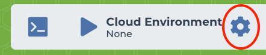
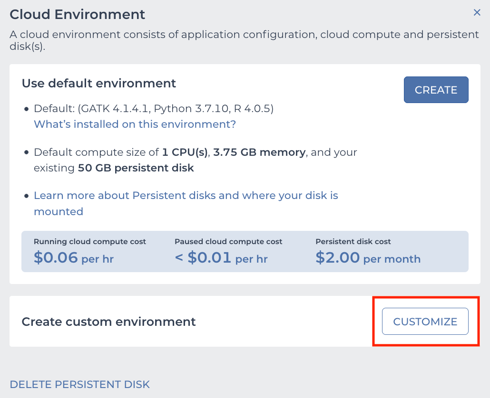
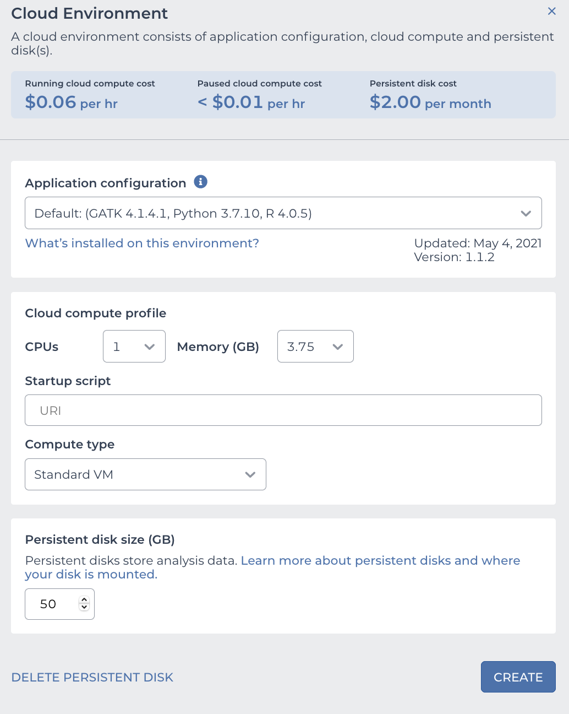
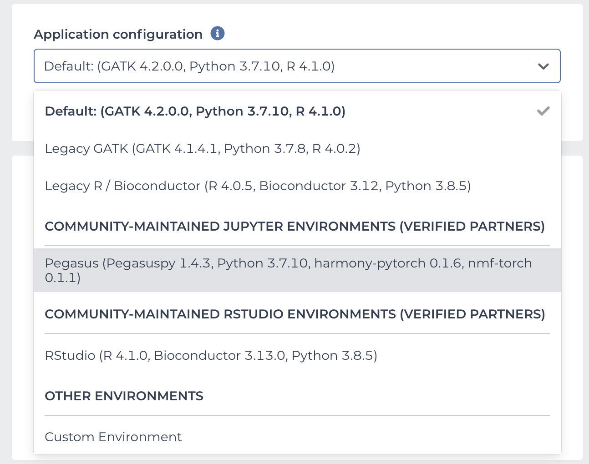
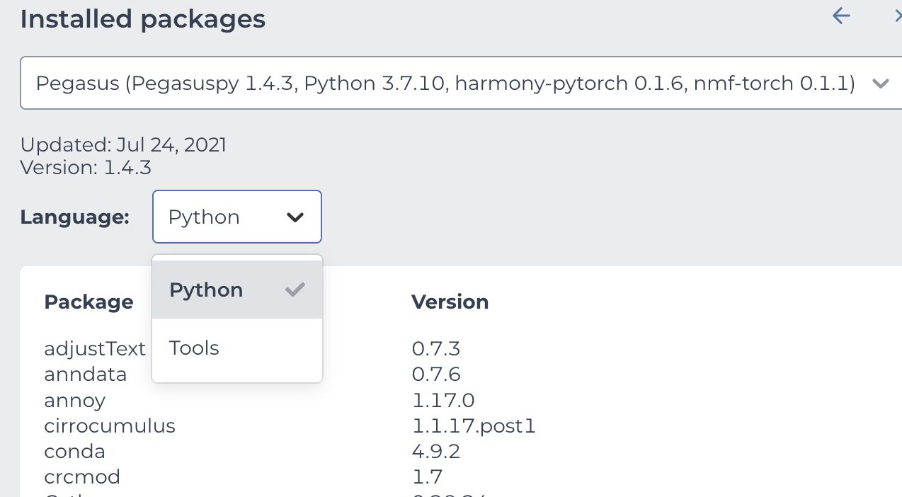
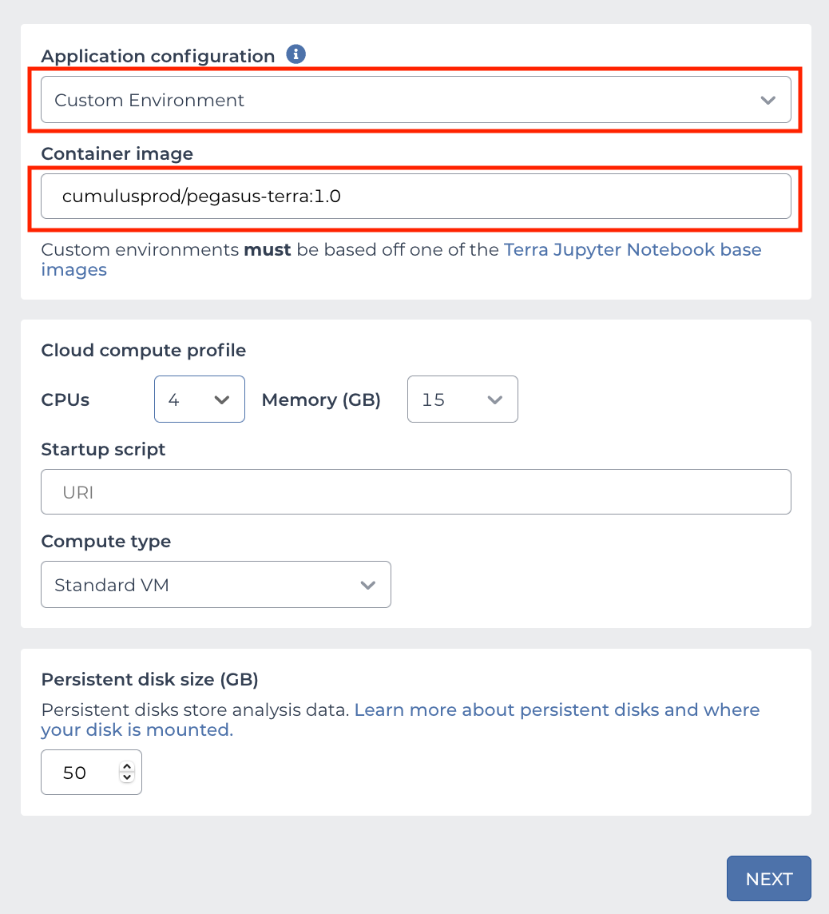
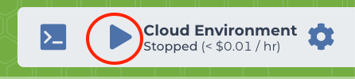

Use Pegasus on Terra Notebook
----------------------------------

You need to first have a `Terra <https://app.terra.bio/>`_ account.

1. Start Notebook Runtime on Terra
^^^^^^^^^^^^^^^^^^^^^^^^^^^^^^^^^^^^^^^^^

The first time when you use Terra notebook, you need to create a Cloud Environment.

On the top-right panel of your workspace, click the following button within red circle:

Then click the ``CUSTOMIZE`` button shown in red regtangle:

Then you'll need to set the configuration of your cloud environment in the pop-out dialog (see image below):

1.1. Create from Terra official environment
~~~~~~~~~~~~~~~~~~~~~~~~~~~~~~~~~~~~~~~~~~~~~

Terra team maintains a list of cloud environments for users to quickly set up their own. In this way, you'll use the most recent stable Pegasus cloud environment.

In *Application configuration* field, select ``Pegasus`` from the drop-down menu:

In case you are interested in looking at which packages and tools are included in the Pegasus cloud environment, please click the ``What's installed on this environment?`` link right below the drop-down menu:

After that set other fields in the pop-out dialog:

* In *Cloud compute profile* field, you can set the computing resources (CPUs and Memory size) you want to use.
* In *Compute type* input, choose ``Standard VM``, as this is the cheapest type and is enough for using Pegasus.
* **(NEW)** In case you need GPUs, select *Enable GPUs*, then choose *GPU type* and type in number of *GPUs* to use. Notice that only version 1.4.3 or later supports this GPU mode.
* In *Persistent disk size (GB)* field, choose the size of the persistent disk for your cloud environment.
  This disk space by default remains after you delete your cloud environment (unless you choose to delete the persistent disk as well),
  but it costs even if you stop your cloud environment.

Now click the ``CREATE`` button to start the creation. After waiting for 1-2 minutes, your cloud environment will be ready to use, and it's started automatically.

1.2. Create from custom environment
~~~~~~~~~~~~~~~~~~~~~~~~~~~~~~~~~~~~

Alternatively, you can create from a custom environment if you want to use an older version of Pegasus.

In the cloud environment setting page:

* In *Application configuration* field, choose ``Custom Environment`` (see the first red rectangle above).
* In *Container image* input, type ``cumulusprod/pegasus-terra:<version>`` (see the second red rectangle above), where ``<version>`` should be chosen from `this list <https://github.com/lilab-bcb/cumulus/blob/master/docker/pegasus-terra/CHANGELOG.md>`_.
  All the tags are for different versions of Pegasus.
* In *Cloud compute profile* field, set the computing resources (CPUs and Memory size) you want to use.
* In *Compute type* field, choose ``Standard VM``, as this is the cheapest type and is enough for using Pegasus.
* In *Persistent disk size (GB)* field, choose the size of the persistent disk for your cloud environment.

When finishing the configuration, click ``NEXT`` button. You'll see a warning page, then click ``CREATE`` button to start the creation.
After waiting for 1-2 minutes, your cloud environment will be ready to use, and it's started automatically.

1.3. Start an environment already created
~~~~~~~~~~~~~~~~~~~~~~~~~~~~~~~~~~~~~~~~~~~

After creation, this cloud environment is associated with your Terra workspace. You can start the same environment anytime in your workspace by clicking the following button within red circle on the top-right panel:

1. Create Your Terra Notebook
^^^^^^^^^^^^^^^^^^^^^^^^^^^^^^^

In the **NOTEBOOKS** tab of your workspace, you can either create a blank notebook, or upload your local notebook.
After creation, click **EDIT** button to enter the edit mode, and Terra will automatically start your cloud environment.

When the start-up is done, you can type the following code in your notebook to check if Pegasus can be loaded and if it's the correct version you want to use::

	import pegasus as pg
	pg.__version__

3. Load Data into Cloud Environment
^^^^^^^^^^^^^^^^^^^^^^^^^^^^^^^^^^^

To use your data on Cloud (i.e. from the Google Bucket of your workspace), you should first copy it into your notebook's cloud environment by Google Cloud SDK::

	!gsutil -m cp gs://link-to-count-matrix .

where ``gs://link-to-count-matrix`` is the Google Bucket URL to your count matrix data file, and ``!`` is the indicator of running terminal commands within Jupyter notebook.

After that, you can use Pegasus function to load it into memory.

Please refer to `tutorials <tutorials.html>`_ for how to use Pegasus on Terra notebook.

4. Stop Notebook Runtime
^^^^^^^^^^^^^^^^^^^^^^^^^

When you are done with the interactive analysis, to avoid being charged by Google Cloud while not using it,
don't forget to stop your cloud environment by clicking the following button of the top-right panel of your workspace within red circle:

If you forget to stop manually, as far as you've closed all the webpages related to your cloud environment (e.g. Terra notebooks, Terra terminals, etc.),
you'll still be safe. In this case, Terra will automatically stop the cloud environment for you after waiting for a few minutes.
