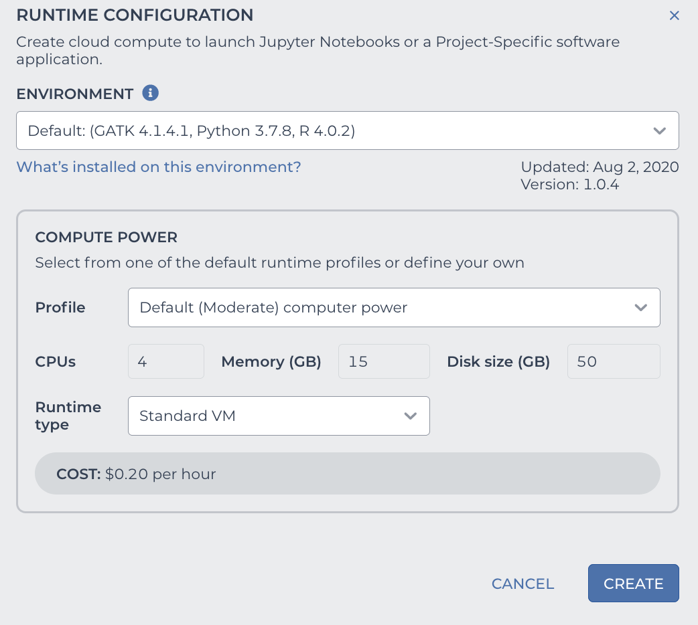

Use Pegasus on Terra Notebook
----------------------------------

You need to first have a `Terra <https://app.terra.bio/>`_ account.

1. Start Notebook Runtime on Terra
^^^^^^^^^^^^^^^^^^^^^^^^^^^^^^^^^^^^^^^^^

The first time when you use Terra notebook, you need to create a runtime environment.

On top-right panel of your workspace, click the following button within red circle:

.. image:: images/create_runtime.png
   :scale: 60 %
   :align: center

Then you'll need to set the configuration of your runtime environment in the pop-out dialog (see image below):

There are 2 ways of creating a runtime environment for Pegasus.

1.1. Create from Terra official environment
~~~~~~~~~~~~~~~~~~~~~~~~~~~~~~~~~~~~~~~~~~~~~

Terra maintains a list of runtimes for users to quickly create an environment.

In *ENVIRONMENT* field, select ``Pegasus`` from the drop-down menu:

.. image:: images/dropdown.png
   :scale: 50 %
   :align: center

After that set other fields in the pop-out dialog:

* In *Runtime type* field, choose ``Standard VM`` (see the third red rectangle above), as this is the cheapest type and is enough to use Pegasus.
* In *COMPUTE POWER* field, you can set the computing resources you want to use.

Now click ``CREATE`` button to start the creation. After waiting for 1-2 minutes, your runtime environment will be ready to use, and it's started automatically.

In this way, you can create your environment with the most updated version of Pegasus.

1.2. Create from custom environment
~~~~~~~~~~~~~~~~~~~~~~~~~~~~~~~~~~~~

Another is to create your environment directly from *Pegasus* docker image which is maintained by Cumulus team. If you want to use an older version of Pegasus, this is way to create your environment.

.. image:: images/runtime_setting.png
   :align: center

* In *ENVIRONMENT* field, choose ``Custom Environment`` (see the first red rectangle above).
* In *CONTAINER IMAGE* field, type ``cumulusprod/pegasus-terra:<version>`` (see the second red rectangle above), where ``<version>`` should be chosen from `this list <https://github.com/klarman-cell-observatory/cumulus/blob/master/docker/pegasus-terra/CHANGELOG.md>`_.
  All the tags are for different versions of Pegasus.
* In *Runtime type* field, choose ``Standard VM`` (see the third red rectangle above), as this is the cheapest type and is enough to use Pegasus.
* In *COMPUTE POWER* field, you can set the computing resources you want to use.

.. note::
    Sometimes DockerHub server may go down. In this situation, we also provide backup docker images on RedHat docker registry. Simply type ``quay.io/cumulus/pegasus-terra:<version>`` in **CONTAINER IMAGE** field.

Now click ``CREATE`` button to start the creation. After waiting for 1-2 minutes, your runtime environment will be ready to use, and it's started automatically.

1.3. Start an environment already created
~~~~~~~~~~~~~~~~~~~~~~~~~~~~~~~~~~~~~~~~~~~

After creation, this runtime environment is associated with your workspace. You can start the same environment anytime in your workspace by clicking the following button within red circle on top-right panel:

2. Create Your Terra Notebook
^^^^^^^^^^^^^^^^^^^^^^^^^^^^^^^

In **NOTEBOOKS** tab of your workspace, you can either create a blank notebook, or upload your local notebook. After creation, click **EDIT** button to enter the edit mode, and Terra will automatically start your notebook runtime.

When the start-up is done, you can type the following code in notebook to check if *Pegasus* can be loaded and if it's the correct version you want to use::

	import pegasus as pg
	pg.__version__

3. Load Data into Runtime
^^^^^^^^^^^^^^^^^^^^^^^^^^^^^^^^^^^

To use your data on cloud (i.e. in the Google Bucket of your workspace), you should copy it into your notebook runtime by Google Cloud SDK::

	!gsutil -m cp gs://link-to-count-matrix .

where ``gs://link-to-count-matrix`` is the Google Bucket URL to your count matrix data file.

After that, you can use Pegasus function to load it into memory.

Please refer to `tutorials <tutorials.html>`_ for how to use Pegasus on Terra notebook.

4. Stop Notebook Runtime
^^^^^^^^^^^^^^^^^^^^^^^^^

When you are done with interactive analysis, don't forget to stop your notebook runtime by clicking the following button of the top-right panel of your workspace within red circle:

Otherwise, Google Cloud will keep on charging you.
