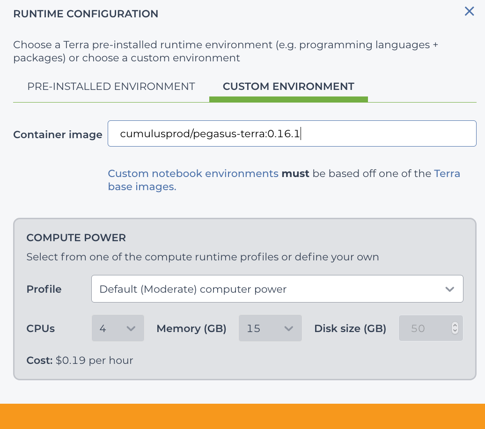

Use ``pegasus`` on Terra Notebook
----------------------------------

You need to first have a `Terra <https://app.terra.bio/>`_ account.

1. Create Your Terra Notebook Runtime
^^^^^^^^^^^^^^^^^^^^^^^^^^^^^^^^^^^^^^^^^

The first time when you use Terra notebook, you need to create a runtime environment. 

On top-right panel of your workspace, click the following button within red circle:

In the pop-out dialog (see image below), select ``CUSTOM ENVIRONMENT`` tab. Then in ``Container image`` field, choose one of Docker images from `Here <https://hub.docker.com/repository/docker/cumulusprod/pegasus-terra>`_. All the tags are for different versions of ``Pegasus``. For example, if you want to use Pegasus version ``0.16.1``, you should type ``cumulusprod/pegasus-terra:0.16.1``:

After that, set the computing resources you want to use in the new runtime environment within ``COMPUTE POWER`` field. And click ``REPLACE`` button, then ``CREATE`` button.

After waiting for 1-2 minutes, your runtime environment should be ready. In the pop-up dialog, click ``APPLY`` button to start.

This runtime environment is associated with your account, not just the current workspace. Therefore, after creation, you can start the same environment in other workspaces by clicking the following button within red circle on top-right panel:

2. Create a Terra Notebook
^^^^^^^^^^^^^^^^^^^^^^^^^^^^

After your 